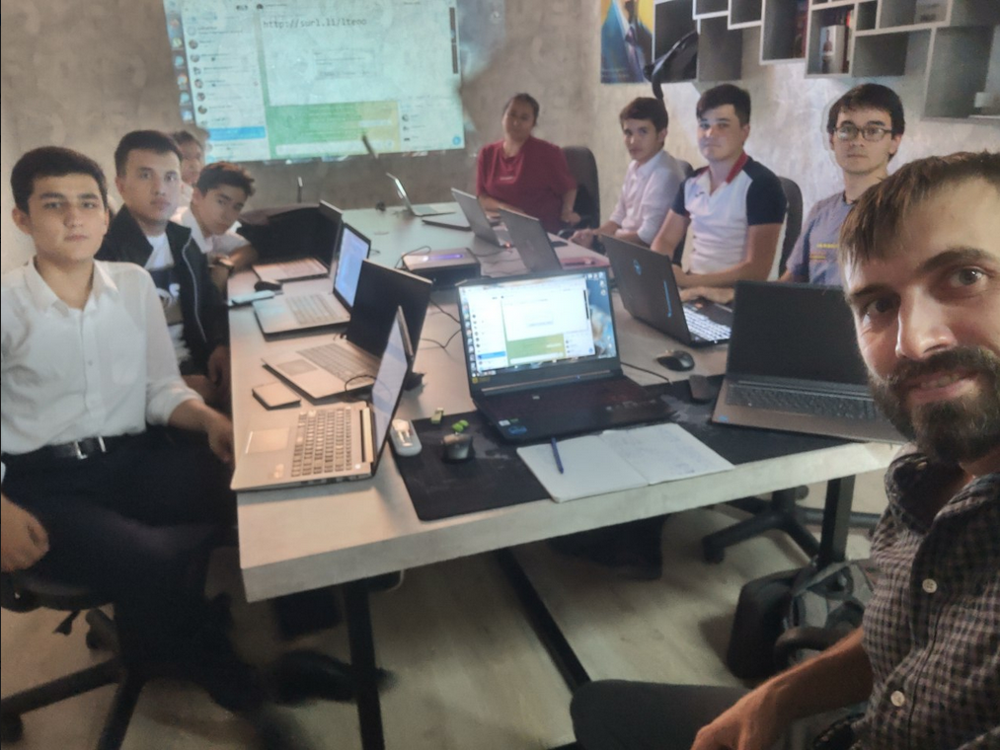

Dear American Space Khujand and ASTI team,

My name is Sergei Alekhin. I’m an embedded engineer and maker with experience designing IoT solutions on Arduino, Raspberry based boards, 3D-printing enclosures, integrating with Home Assistant, and mentoring youth. In recent years, I’ve been running practical workshops and one-on-one courses (Arduino, Python, web development), also growing online  communities, and creating interactive IoT projects — from smart greenhouses to access control systems and AI-based image processing.

I resonate with American Space’s mission: to help people discover their talents, grow, and achieve more. I genuinely enjoy explaining complex things in simple, precise language :) I’d be glad to launch a hands-on program in your makerspace focused on practical engineering and DIY skills through robotics programming or building custom smart-home devices, applying advanced AI-engineering techniques. I already have experience with both individual and group instruction and consulting. I love learning and teaching motivated students. You can be assured that safety during practice sessions will be a key principle. I can run the program or workshops in either English or Russian. I would also appreciate a budget allocation to deliver the training.

I currently reside in Khujand (temporary stay), and I’m open to part-time or project-based work and to discussing collaboration formats. I’d be happy to share more details and present a portfolio of my projects and training programs.
You can explore my CV and CL deeply by keeping dialogue in chatGPT here: https://chatgpt.com/share/68d6c7c1-69f8-8012-b1fc-2c262ef0adbc

Sincerely,
Sergei Alekhin
Telegram: @dyingseed
